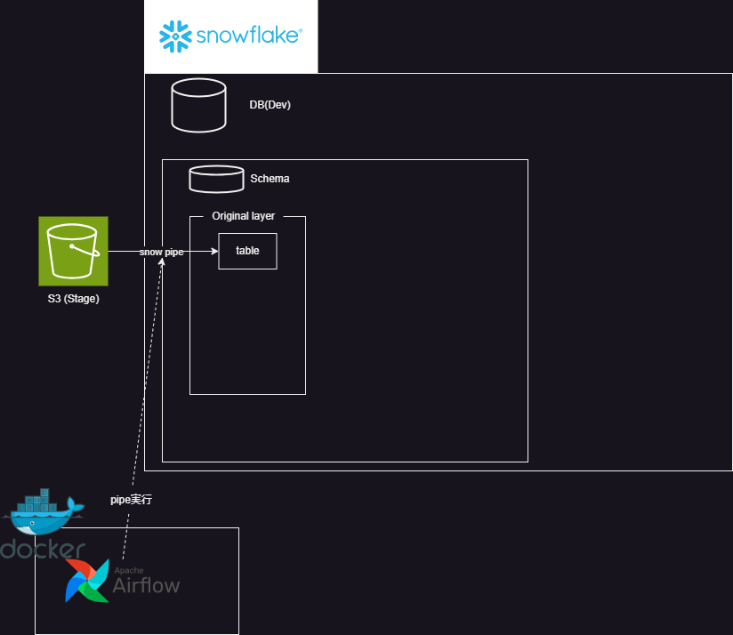
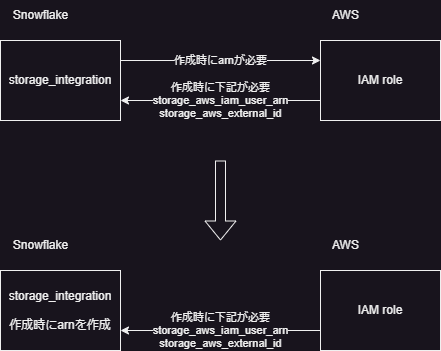

# Snowflake-dbt-Terraform

### 目的
- [こちら](https://speakerdeck.com/kevinrobot34/snowflake-dbt-terraform?slide=7)の再現実装を行う
- ただし、財布事情を考慮して、ECRを使うところはWSL上のコンテナになったりする。

#### 現在までの構成図

### snowflake, S3
#### 概要
S3に格納されたデータをpipeをもってsnowflakeのテーブルに格納する。  
S3からの取り込み方法としてpipeの自動実行があるが、コスト面と即時性は別に要らない点を考慮してAirflowで定期取り込みとする。  
~~snowflake_notification_integrationとかの設定めんどくさそう。~~

#### 環境変数
- AWS_ACCESS_KEY_ID=XXXXX
- AWS_SECRET_ACCESS_KEY=XXXXX
- SNOWFLAKE_ACCOUNT_NAME=XXX
- SNOWFLAKE_ORGANIZATION_NAME=XXXX
- SNOWFLAKE_PASSWORD=XXXXX
- SNOWFLAKE_REGION=us-east-1
- SNOWFLAKE_ROLE=ACCOUNTADMIN
- SNOWFLAKE_USER=XXXX

#### Todo(課題・検討事項)

- namespace_varの適切な分割粒度

- ロール、グラントの置き場所。snowflake_account_roleとsnowflake_database_roleで分けるのはいいとして、snowflake_database_roleはどこに置くか？

- 権限付与の仕方。database_role→account_role→userとしているが、[こちら](https://docs.snowflake.com/en/user-guide/security-access-control-overview)を見るに直接database_role→userとできそうだが、[ドキュメント](https://registry.terraform.io/providers/snowflakedb/snowflake/latest/docs/resources/grant_database_role)でそれらしいresourceを見つけられていない。snowflakeにはあるがterraformの機能としては存在していない？→[これ](https://registry.terraform.io/providers/snowflakedb/snowflake/latest/docs/resources/grant_privileges_to_account_role)でいけそう。
- yamlに情報持たせすぎ？

- yaml内の構成。インデント深くなりすぎないように分割しているが、もうちょいまとめてもいいかも。roleとか。

- yamlの構成がまずく、同じものを指すものが複数個所にあるのが嫌。file_formatのformat_typeとpipeのtarget_formatとか。

- s3と紐づけられないため、storage_integrations単体しか作れないようになってる。rootにおいてバケット名との関連をyamlで示すようにすれば紐づけできそう。

- 大文字小文字の区別がある部分はupperつけるとかしたほうがいいかも

- 一回目の実行でpipeの作成エラーとなるが、続けてもう一度実行すると成功する。
~~~
  ╷
  │ Error: 003167 (42601): Error assuming AWS_ROLE:
  │ User: arn:aws:iam::241636745402:user/ryp81000-s is not authorized to perform: sts:AssumeRole on resource: arn:aws:iam::439309983733:role/S3ToStorage_integration
  │
  │   with snowflake_pipe.pipe["TEST_PIPE"],
  │   on main.tf line 1, in resource "snowflake_pipe" "pipe":
  │    1: resource "snowflake_pipe" "pipe" {
  exit status 1
~~~
pipe作成を行うhclのdependenciesにIAMの作成を設定しているが、terraformでの作成完了と実際に作成が完了するまでにラグがあるっぽい？要確認。

- 完全修飾いるところの入力を分けてる(database_nameとschema_name入力させてる)けど場所によってはまとめたほうがよさそう。grants_ownershipは今回pipeしかやってないからdb.schema.~でいいけどdb.~の場合とかありそうだしとりあえず分けないでおく。ほかのところもちゃんと検討すべきだった。

#### Done
- [チュートリアル](https://docs.snowflake.com/ja/learn-tutorials)
半構造化、S3以外のクラウドは未実施

#### つまったとこ

- stage_integrationとIAWで循環参照

→stage_integrationで作成されるarnをあらかじめ作成して設定。
[参考](https://docs.snowflake.com/ja/user-guide/data-load-s3-config-storage-integration)

- output "storage_aws_external_id" が出力されない。
→value = snowflake_storage_integration.this.describe_output[0].storage_aws_external_id[0].value
で出せるけど複数作るときとかフォルダ分けないと破綻する。

- depndencies設定してるのに対象がない扱いのエラー（Integration 'TEST_STORAGE_INTEGRATION' associated with the stage 'TEST_STAGE' cannot be found.）。対象名も間違っていない。
→キャッシュ消す→already exist→destroy→applyで解消。キャッシュか？

- 存在するオブジェクトに対してError: [errors.go:23] object does not exist or not authorized. なお権限はACCOUNTADMINで、dependenciesは設定済み。名称間違いもない。
~~~sql
COPY INTO TEST_DB.TEST_SCHEMA.TEST_TABLE
FROM @TEST_DB.TEST_SCHEMA.TEST_STAGE
FILE_FORMAT = (FORMAT_NAME = TEST_FORMAT);
~~~
webUI上で上記実行もできない
→
~~~sql
USE DATABASE TEST_DB;
USE SCHEMA TEST_SCHEMA;
~~~
した後、WebUI上で実行できた。
→完全修飾名での指定が必要。

### Airflow
#### 概要
snowpipe,dbtの処理を定期的に行う

#### Todo(課題・検討事項)
- 接続情報を.envに記載し、コンテナ内でこれを参照するようにしているが、中身はローカルPC上の環境変数と同一のため、可能であればリテラルにしたくない。対応方法なさそうではある。まあ実務でこんな動かし方しなさそうではあるが。

#### Done
- [チュートリアル](https://airflow.apache.org/docs/apache-airflow/stable/tutorial/index.html)

#### Todo
- [監査ログ](https://airflow.apache.org/docs/apache-airflow/stable/security/audit_logs.html)
- [モニタリング](https://zenn.dev/dataheroes/articles/2021-12-07-snowpipe-monitoring)