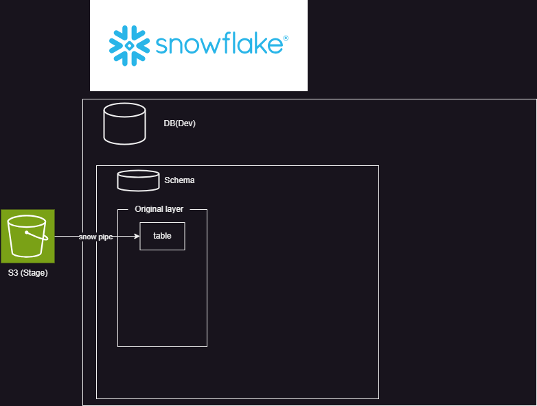

# Snowflake-dbt-Terraform
こちらの再現実装を行う
https://speakerdeck.com/kevinrobot34/snowflake-dbt-terraform?slide=7

S3からの取り込み方法としてpipeの自動実行があるが、コスト面と即時性は別に要らない点を考慮してAirflowで定期取り込みとする。
~~snowflake_notification_integrationとかの設定めんどくさいしね。~~
#### 現在までの構成図

#### 検討事項
- namespace_varの適切な分割粒度
- ロール、グラントの置き場所。snowflake_account_roleとsnowflake_database_roleで分けるのはいいとして、snowflake_database_roleはどこに置くか？
- 権限付与の仕方。database_role→account_role→userとしているが、[こちら](https://docs.snowflake.com/en/user-guide/security-access-control-overview)を見るに直接database_role→userとできそうだが、[ドキュメント](https://registry.terraform.io/providers/snowflakedb/snowflake/latest/docs/resources/grant_database_role)でそれらしいresourceを見つけられていない。snowflakeにはあるがterraformの機能としては存在していない？→[これ](https://registry.terraform.io/providers/snowflakedb/snowflake/latest/docs/resources/grant_privileges_to_account_role)でいけそう。
- yamlに情報持たせすぎ？
- yaml内の構成。インデント深くなりすぎないように分割しているが、もうちょいまとめてもいいかも。roleとか。
- yamlの構成がまずく、同じものを指すものが複数個所にあるのが嫌。file_formatのformat_typeとpipeのtarget_formatとか。
‐ s3と紐づけられないため、storage_integrations単体しか作れないようになってる。rootにおいてバケット名との関連をyamlで示すようにすれば紐づけできそう。